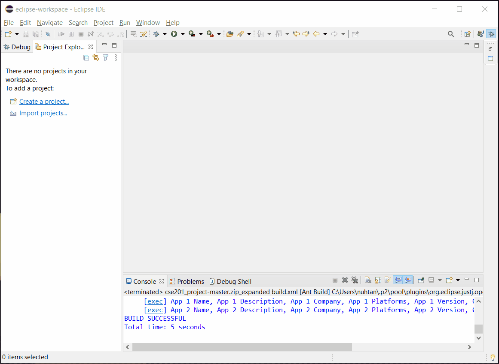

# CSE 201 Project
## Miami Software Company

Zack Collier, Craig Conner, Qi Feng, Brett Herman, Nathaniel Richardson

## [Installation](#Installation)
### Using Eclipse
- Download the project as a zip with the green button at the top of the repo
- Open Eclipse
- File -> Open Projects from File System...
- Click Archive... and select the downloaded zip file
- Right click cse201_project-master.zip_expanded, go to properties
- Select 'Java Build Path' on the right menu, go to the 'Libraries' tab
- Click 'Classpath', click the 'Add Library...' button on the right
- Select JUnit, press next, select JUnit5, Finish, Apply and Close
- To run with Ant, expand the cse201_project-master folder
- Right click build.xml, select 'run as...', select Ant Build

### CLI with Git and Ant
    $ git clone https://github.com/zackcollier/cse201_project.git
    $ cd cse201_project
    $ ant
Make sure that Ant is properly installed and both your JAVA_HOME and ANT_HOME environment variables are set.

## Documentation
### Application
- Each app has a name, description, company, ratings, comments, version, and genre associated with it
- The details of apps can be shown
- Apps will have a calculated average rating
### User
- Each user has a username and password
- Each user can login, signup, and log out
- Users can give an app a rating, leave a comment on an app, and search within fields for apps
- Users can sort a list of apps, with the comparators given in the class
### Developer
- Type of user, but has a company name
- Developers can edit the details of an app, but not comments and ratings
- Developers can only edit if their company name matches
- Developers can submit requests for apps/changes to be comitted to the app
### Moderator
- Type of user, but can delete comments from app comment sections
### Admin
- Type of Moderator, but can view and approve requests for apps to be put into the app
### Storage
- User information stored in login_system.txt
- App information stored in App_data.txt
### AppOrganizationTool
- Where the app instance is run
- Holds and retrieves from files the user and app data
- 
## [Testing](testing.md)
